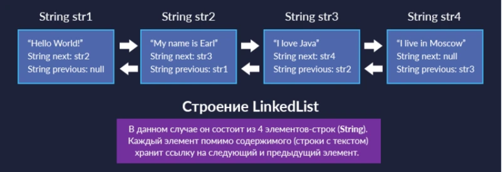
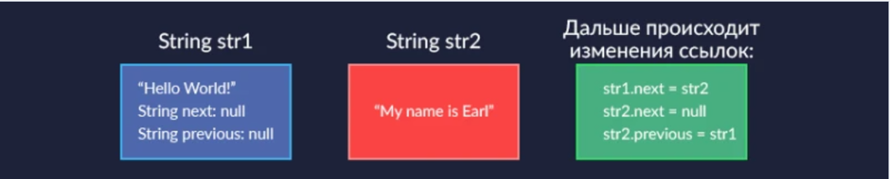
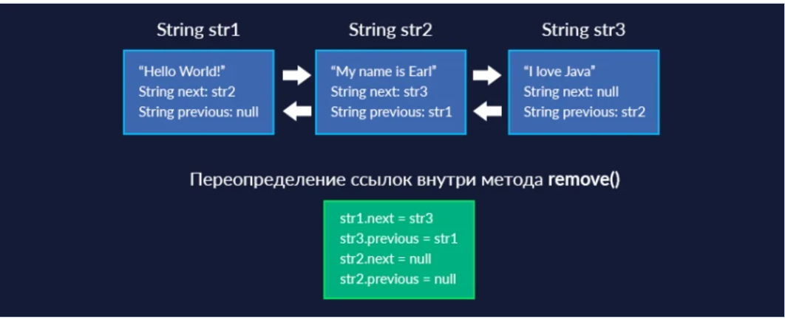
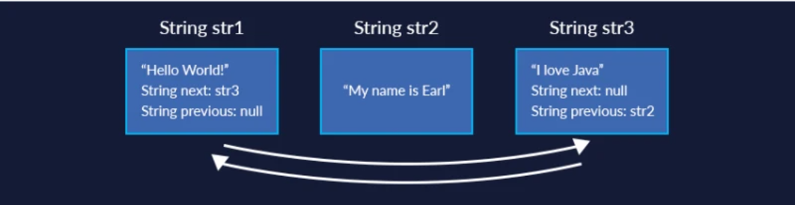
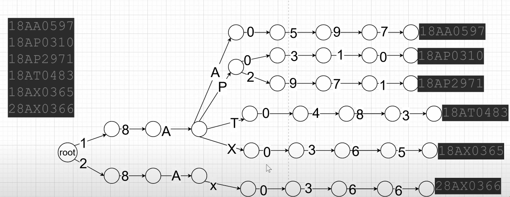

## LinkedList - двухсвязанный список

#### task1 - сравниваем скорость выполения удаления и добавления первого элемента в двухсвязанном списке и ArrayList, LinkedList побеждает

#### task2 - обращение к конкретному элементу - здесь побеждает ArrayList 
#### task3 -  Реализация дека (Deque — двусторонняя очередь):

Дек позволяет добавлять и удалять элементы с обоих концов (с начала и с конца). Двусвязный список — естественный выбор для реализации дека, поскольку обе операции эффективны на любом конце списка. 
#### task4 - работа с префиксным деревом, его создание 
 
